# Geometry-Based Path Planning for Parallel Parking

<figure align="center">
  <video src="https://github.com/user-attachments/assets/9ad1b1fe-018f-4fb5-b3d0-b1a23579d13b" autoplay loop muted playsinline width="500"></video>
  <figcaption><i>Simulation of the geometry-based parallel parking path.</i></figcaption>
</figure>


## Table of Contents
- [Project Overview](#project-overview)
- [Use This Package](#use-package)
- [File Structure](#file-structure)
- [Vehicle Model](#vehicle-model)
- [Core Strategy](#core-strategy)
- [Simulation Method](#simulation-method)
- [Result](#result)
- [Discussion](#discussion)
- [Conclusion](#conclusion)
- [Reference](#reference)


## Project Overview
This project focuses on developing, simulating, and evaluating geometric path planning algorithms for autonomous parallel parking. It is designed to handle varying parking space constraints and compute mathematically optimal trajectories using a kinematic **bicycle model**.

The core of the system calculates feasible paths using the vehicle's minimum turning radius, wheelbase, and overhang constraints. Depending on the parking spot length and maximum steering angle, the planner dynamically switches between different parking strategies:

- **Single-Trial Parking** 
    Utilized when the parking space is large enough. The algorithm computes a continuous two-arc reverse maneuver, finding the exact tangent point to smoothly transition between opposing steering angles.

- **Crab-Like (Shunt) Parking**
    Initiated when the space is tight but strictly larger than the vehicle footprint. The algorithm calculates the required lateral offset and executes a sequence of forward-backward shunting loops, alternating steering extremes to laterally shift the vehicle deeply into the spot without collisions.

- **Human-Like Parking**
    Deployed in constrained spaces as a highly efficient alternative. Using Finite State Machine logic, it prioritizes practical alignment over strict mathematical precision. By terminating corrective shunting once obstacles are cleared and the yaw error is minimal, it drastically reduces gear changes and computational load, delivering a faster, smoother maneuver.

### Limitations
This project focuses on the core kinematics of parallel parking between two longitudinal obstacles. The simulated environment assumes the following constraints:
- The vehicle must maneuver between a defined front and rear vehicle (represented by static bounding boxes).
- The simulation currently assumes infinite lateral space opposite the parking spot (i.e., no oncoming traffic or opposite curbs to restrict the turning radius).
- The system does not currently include perception-based detection or collision avoidance for lateral boundaries such as sidewalks, curbs, or walls.

### Key Performance Indicators 
To evaluate the efficiency and accuracy of each parking strategy, the system tracks specific KPIs during simulation:

- **Number of Gear Changes**
    Measures the maneuver's efficiency. Fewer gear changes indicate a smoother, more optimal path.

- **Final Lateral Position**
    Evaluates the vehicle's final resting lateral (Y) compared to the ideal target center of the parking spot to ensure safe alignment.

### Simulation Approach
The algorithms are rigorously tested within the CARLA simulator integrated with ROS 2. The simulation method involves systematically varying key physical constraints—specifically the parking spot length ($L$) and the vehicle's maximum steering angle ($\delta_{max}$)—to observe how the planners adapt. Automated data logging records the vehicle's odometry, steering commands, and KPIs across these varying scenarios to evaluate the robustness, mathematical limits, and overall success rate of each parking method.


## Use This Package
This package is divided into 2 versions:
- Carla-ROS: implements the single-trial and crab-like parking methods
- Pure Carla: implements the human-like parking method [here](https://github.com/phattanaratjeedjeen-sudo/parallel_parking/tree/Human)

### Carla-ROS

#### Environment
- OS: ubuntu 24.04
- ROS2: Jazzy
- Carla: 0.9.16
- Carla-ROS bridge

#### Steps
1. Clone this package
    ```bash
    cd ~
    git clone https://github.com/phattanaratjeedjeen-sudo/parallel_parking.git
    ```

2. Set up environment
    ```bash
    cd ~/park_ws
    colcon build && source install/setup.bash
    ```

    ```bash
    echo "source ~/park_ws/install/setup.bash" >> ~/.bashrc  
    source ~/.bashrc
    ```

3. Set up parking spot
    ```bash
    # set park length to 6.2m
    python3 ~/park_ws/src/lka_bringup/scripts/update_spawn_config.py 6.2

    # build and source every time when changing park length
    colcon build --packages-select lka_bringup && source install/setup.bash
    ```

4. Launch
    ```bash
    cd ~/carla
    ./CarlaUE4.sh -windowed -ResX=800 -ResY=600 -prefernvidia -quality-level=Low
    ```

    Open new terminal
    ```bash
    cd ~/park_ws
    ros2 launch lka_bringup bring_up_carla.launch.py
    ```

    Open new terminal
    ```bash
    cd ~/park_ws
    # L must match with step3
    ros2 launch lka_bringup parking_control.launch.py L:=6.2 max_steer:=35.0
    ```

### Pure Carla

#### Environment
| Dependency | Notes |
|---|---|
| [CARLA Simulator](https://carla.org/) | Tested on CARLA 0.9.x — must be running before launching the script |
| Python 3.7+ | |
| `carla` Python package | Provided with the CARLA installation (`PythonAPI/`) |
| `pygame` | `pip install pygame` |
| `numpy` | `pip install numpy` |

#### Steps
1. Start the CARLA server
    ```bash
    # Windows
    CarlaUE4.exe

    # Linux
    ./CarlaUE4.sh
    ```

2. Run the parking simulation

    This version run in window with python version 3.7
    ```bash
    py -3.7 .\spawn_car_.py  
    ```

    The script will:
    1. Connect to `localhost:2000`
    2. Spawn two parked Tesla Model3 vehicles and one ego vehicle
    3. Execute the autonomous parking sequence autonomously
    4. Save logs on exit

3. Plot the results

    After a run, two log files are created in the working directory:
    Then Edit the filenames at the top of `graphplotter.py` to match, then run:

    ```bash
    py -3.7 .\graphplotter.py
    ```

    This opens a 2×3 figure with:

    | Graph | Content |
    |---|---|
    | 1 | Trajectory — X vs Y position |
    | 2 | Velocity over time (m/s) |
    | 3 | X and Y position over time |
    | 4 | Acceleration over time (m/s²) |
    | 5 | Jerk over time (m/s³) |
    | 6 | Steering wheel angle over time (°) |

## File Structure

### Carla-Ros
```text
data
├── car_info                        -> car dimension
└── results                         -> all crab results
material
├── images                          -> images in readme
└── reference                       
src/lka_bringup/
├── config/
│   └── objects.json                -> spawn configuration
├── launch/
│   ├── bring_up_carla.launch.py    -> manage carla-ros connection
│   └── parking_control.launch.py   -> main launch file
└── scripts/
    ├── log_data.py                 -> logger output      
    ├── park_planning.py            -> main script
        ├── plot_results.py             -> plot individual results
        └── update_spawn_config.py      -> change front obstacle spawn point
```

### Pure Carla
```text
.
├── spawn_car.py      # Main autonomous parking simulation
├── graphplotter.py   # Plot trajectory & dynamics from saved logs
└── pathtest.py       # Standalone geometry / turning-radius calculator
```

## Vehicle Model
This project utilizes a standard **kinematic bicycle model** to plan and evaluate parking trajectories. The model simplifies the vehicle's kinematics by representing the two front wheels as a single steerable front wheel, and the two rear wheels as a single fixed rear wheel. 

To guarantee collision-free maneuvers, path planning is calculated using the center of the rear axle as the primary reference frame. The vehicle's footprint is expanded using dimensions like overhangs and mirror offsets to ensure the bounding box does not intersect with obstacles.

<figure align="center">
  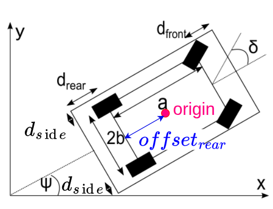
  <figcaption><i>Vehicle kinematic model parameters.</i></figcaption>
</figure>

### Vehicle Parameters
Below are the core vehicle (Tesla Model 3) parameters:

| Notation | Description | Default Value |
| :------------------ | :---------- | :------------ |
| $\delta_{max}$  | Maximum steering angle limit                               | `35.0` deg |
| $a$             | Wheelbase (distance from rear axle to front axle)          | `3.005` m  |
| $b$             | Half track width                                           | `0.835` m  |
| $d_{front}$     | Front overhang (distance from front axle to front bumper)  | `0.81` m   |
| $d_{rear}$      | Rear overhang (distance from rear axle to rear bumper)     | `0.98` m   |
| $d_{side}$      | Side overhang (distance to the outer edge of side mirrors) | `0.25` m   |
| $L_{car}$       | Total vehicle length ($a + d_{front} + d_{rear}$)          | `4.795` m  |
| $offset_{rear}$ | Distance from the vehicle's origin to the rear axle        | `1.42` m   |

Using these parameters, the system dynamically calculates essential pathing limits, such as the minimum turning radius of the rear axle ($R_{E, min}$) based on Ackermann steering geometry:  

$$
R_{E, min} = \frac{a}{\tan(\delta_{max})}
$$

## Core Strategy

### Single Trial
This maneuver is triggered when the parking space is large enough ($L \ge L_{min}$) to allow continuous reverse entry using two circular arcs. Let the starting rear axle pose be $(x_s, y_s, \psi_s)$ and the target rear axle pose be $(x_t, y_t, \psi_t)$.

<figure align="center">
  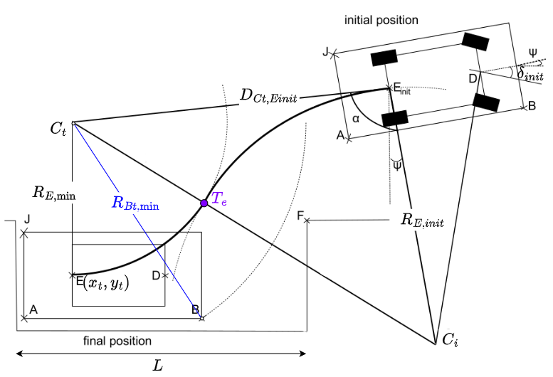
  <figcaption><i>Single trial parking maneuver geometry.</i></figcaption>
</figure>

**Minimum Spot Length Calculation**

The minimum required parking length $L_{min}$ to park without shunting is determined by the vehicle's turning radius and spatial footprint:

$$
R_{Bt, min} = \sqrt{(R_{E, min} + b + d_{side})^2 + (a + d_{front})^2}
$$

$$
L_{min} = d_{rear} + \sqrt{R_{Bt, min}^2 - (R_{E, min} - b - d_{side})^2}
$$

**Target Turning Center ($C_t$)**

The final arc always uses the minimum turning radius ($R_{E, min}$). For a right-side parking maneuver, its center $C_t$ is:

$$
C_{t,x} = x_t + R_{E,min} \cos\left(\psi_t + \frac{\pi}{2}\right)
$$

$$
C_{t,y} = y_t + R_{E,min} \sin\left(\psi_t + \frac{\pi}{2}\right)
$$


**Feasibility Check (Condition to Begin)**

The distance from the start position to the target turning center $d_{Ct,Einit} = \sqrt{(C_{t,x} - x_s)^2 + (C_{t,y} - y_s)^2}$ must satisfy a minimum geometric bound. Where $\alpha$ is the angle between the starting lateral vector and the vector to $C_t$:
    
$$
d_{Ct,Einit,min} = R_{E,min} \cos\alpha + \sqrt{(R_{E,min} \cos\alpha)^2 + 3 R_{E,min}^2}
$$

If $d_{Ct,Einit} < 1.05 \cdot d_{Ct,Einit,min}$ (for safety) the path is unfeasible, and the vehicle must adjust forward to create more space.

**First Arc Radius and Steering Angle** 

If feasible, the turning radius for the first arc ($R_{E,init}$) is calculated to ensure the two circles perfectly touch:

$$
R_{E,init} = \frac{d_{Ct,Einit}^2 - R_{E,min}^2}{2 R_{E,min} + 2 d_{Ct,Einit} \cos\alpha}
$$

The initial steering angle ($\delta_{init}$) is computed via Ackermann geometry:

$$
\delta_{init} = \arctan\left(\frac{a}{R_{E,init}}\right)
$$

**Initial Turning Center ($C_i$) & Tangent Point ($T_e$)**

The center for the first arc ($C_i$) is located at distance $R_{E,init}$ perpendicular to the starting orientation:

$$
C_{i,x} = x_s + R_{E,init} \cos\left(\psi_s - \frac{\pi}{2}\right)
$$

$$
C_{i,y} = y_s + R_{E,init} \sin\left(\psi_s - \frac{\pi}{2}\right)
$$
    
The transition tangent point ($T_e$) is where the vehicle switches steering. It lies on the line segment connecting $C_i$ and $C_t$, weighted by their radii:

$$
T_{e,x} = C_{i,x} + \frac{R_{E,init}}{R_{E,init} + R_{E,min}} (C_{t,x} - C_{i,x})
$$

$$
T_{e,y} = C_{i,y} + \frac{R_{E,init}}{R_{E,init} + R_{E,min}} (C_{t,y} - C_{i,y})
$$

$$
\psi_{Te} = \text{atan2}(-C_{t,x} + C_{i,x}, C_{l,y} - C_{r,y})
$$

| Notation | Description | unit |
| :--- | :--- | :--- | 
| $L_{min}$          | Minimum required parking length to park without shunting            | m  |  
| $R_{Bt, min}$      | Minimum turning radius of the vehicle's bounding box                | m  |  
| $x_s, y_s, \psi_s$ | Starting pose of the vehicle's rear axle (X, Y, Yaw)                | m  |  
| $x_t, y_t, \psi_t$ | Target pose of the vehicle's rear axle (X, Y, Yaw)                  | m  |  
| $C_t$              | Turning center of the target (final) arc                            | m  |  
| $\alpha$           | Angle between the starting lateral vector and the vector to $C_t$   | rad| 
| $d_{Ct,Einit}$     | Distance from the start position to the target turning center $C_t$ | m  | 
| $d_{Ct,Einit,min}$ | Minimum required distance to $C_t$ for a feasible single-trial path | m  | 
| $R_{E,init}$       | Turning radius of the first arc                                     | m  | 
| $R_{E,min}$        | Minimum turning radius of the rear axle                             | m  |  
| $\delta_{init}$    | Steering angle required for the first arc                           | rad| 
| $C_i$              | Turning center of the initial (first) arc                           | m  | 
| $T_e$              | Tangency point where the vehicle transitions between the two arcs   | m  |
| $\psi_{Te}$        | Heading angle at the tangency point                                 | rad| 

### Crab-Like Parking
When the parking spot is too tight for a single maneuver ($L_{car} < L < L_{min}$), the system employs a shunting strategy modeled after crab-walking. 

<figure align="center">
  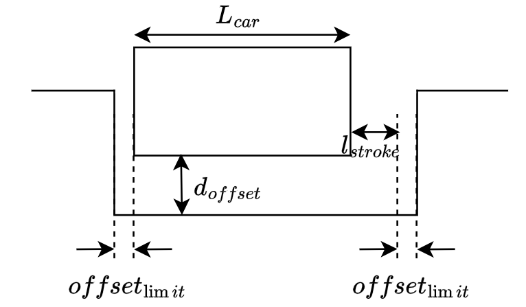
  <figcaption><i>Crab-like parking maneuver shunting loops.</i></figcaption>
</figure>

**Lateral Offset**

The algorithm calculates the maximum depth the vehicle *can* safely reach in a single initial reverse trial. It sets a temporary parallel target pose outside the spot by a lateral distance of $d_{offset}$.

**Shunting Loops**

Once aligned at this offset, the vehicle shifts laterally into the spot by performing $N$ forward-backward loops. During each longitudinal stroke, the steering smoothly alternates between maximum left and right angles ($\pm\delta_{max}$) to maximize lateral movement.

**Displacement Math**

The lateral displacement per stroke ($\Delta y$) relies on the available longitudinal clearance ($l_{stroke}$):

$$
l_{stroke} = (L - L_{car}) - 2 \cdot offset_{limit}
$$

$$
\Delta y = 2 \cdot \left( R_{E,min} - \sqrt{ \max\left(0, R_{E,min}^2 - \left(\frac{l_{stroke}}{2}\right)^2\right) } \right)
$$
   
The required number of total shunting loops ($N_{trials}$) is computed dynamically to cover the total $d_{offset}$:

$$
N_{trials} = \left\lfloor \frac{d_{offset}}{2 \cdot \Delta y} + 0.5 \right\rfloor
$$

| Notation | Description | unit | Value |
| :--- | :--- | :--- | :--- |
| $L_{car}$        | Total length of the vehicle                                      | m | `4.80`|  
| $L$              | Length of the parking spot                                       | m |       |
| $d_{offset}$     | Total lateral distance needed to shift into the parking spot     | m |       |
| $l_{stroke}$     | Available longitudinal clearance for each shunting stroke        | m |       |
| $offset_{limit}$ | Minimum safety clearance maintained from obstacles during shunts | m | `0.10`|
| $\Delta y$       | Lateral displacement gained per single longitudinal stroke       | m |       |
| $N_{trials}$     | Total number of required shunting loops (1 forward + 1 backward) | times |   |

Below is how `single` and `crab-like` method works togather to achieve parking in tiny spots.

<figure align="center">
  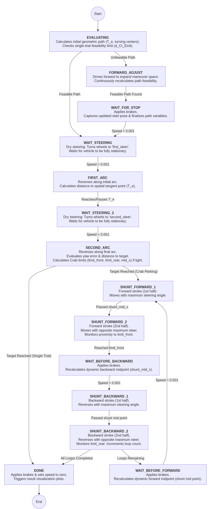
  <figcaption><i>Flowchart of single and crab-like parking methods.</i></figcaption>
</figure>

### Human-Like Parking

<figure align="center">
  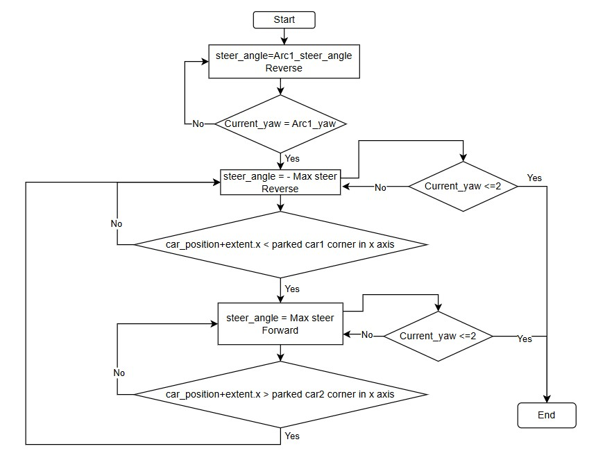
  <figcaption><i>Flowchart of human-like parking methods.</i></figcaption>
</figure>

The initial steering angle is set for the first turning maneuver, and the vehicle reverses until its yaw angle reaches the target yaw angle obtained from the calculation. The maneuver starts by moving the vehicle to the same x-coordinate as the leading parked vehicle. The vehicle then reverses with the specified steering angle until the calculated yaw angle is reached. Subsequently, the vehicle performs alternating forward-left and reverse-right maneuvers until the yaw angle is less than or equal to 2°.

## Simulation Method
To test all planning methods (single, crab-like, human-like), there are 2 parameters to vary:
1. the parking spot length
2. the maximum steering angle
While varying these parameters, the ego vehicle's spawn point, obstacle sizes, park offset, and target parking position are fixed.

| Notation(unit) | Description | Value(start/step/stop) | type |
| --------  | -------- | -------- | -------- |
| $\delta_{max}$(deg) | maximum steering angle               | 30/5/40     | vary |
| $L$(m)              | park spot length                     | 5.2/0.5/7.2 | vary |
| $c$(m)              | rear-front park offset               | 0.1         | fix  |
| $p$(m)              | front obstacle-car side distance     | 0.3         | fix  |
| $x_s, y_s$ (m)      | spawn position                       |             | fix  |
| $x_f, y_f$ (m)      | target position                      |             | fix  |

<figure align="center">
  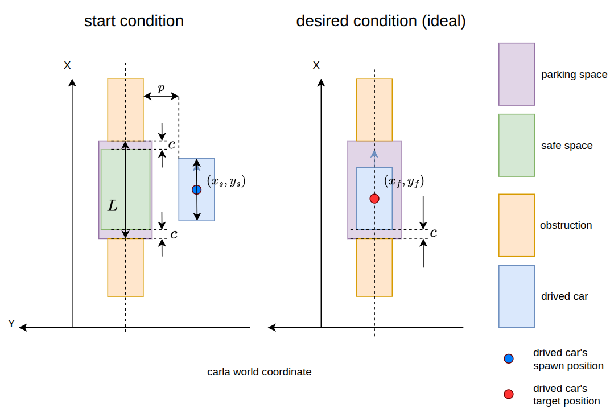
  <figcaption><i>Simulation method and fixed/variable parameters.</i></figcaption>
</figure>

Log parameters

| Notation(unit) | Description | 
| -------- | -------- | 
| n(times) | number of times the gear was changed | 
| x, y (m) | car position                         | 

## Result

### Number of gear changes (N)
    
<figure align="center">
  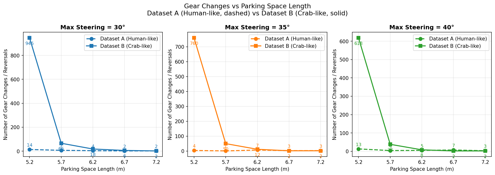
  <figcaption><i>Comparison of number of gear changes, max steering angle and park length with both algorithms.</i></figcaption>
</figure>

For more clarity, see the heatmaps below.

<div align="center">

| 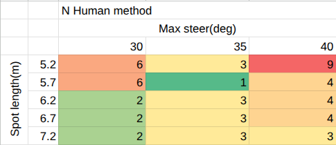 | 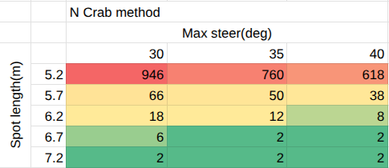 |
|:---:|:---:|
| <i>Heatmap visualize N for human-like algorithm.</i> | <i>Heatmap visualize N for crab-like algorithm.</i> |

</div>

### Path shape

<figure align="center">
  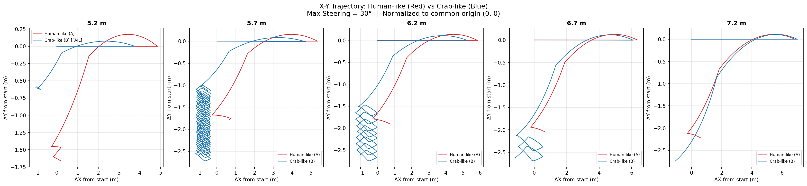
  <figcaption><i>Path shape comparison.</i></figcaption>
</figure>

Due to the huge amount of difference in gear change times between both approaches, the human-like algorithm is significantly smoother than the crab method. (The result at a 5.2m spot length for the crab method is not completely correct because of the large amount of trials).

### Final lateral error

<figure align="center">
  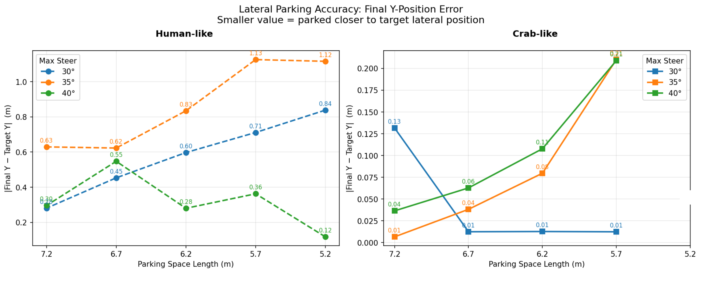
  <figcaption><i>Final lateral error parking.</i></figcaption>
</figure>

However in terms of lateral error at resting. The human-like shows huge lateral error compares to crab-like at spot length from 7.2m to 5.7m

## Discussion

This section provides a comparative analysis between the Crab-like and Human-like path planning methods, specifically examining the effects of parking spot length and maximum steering capacity on shunting effort (number of gear changes) and final lateral accuracy.

### The number of gear changes (N)

- **Planning method**: The Human-like algorithm, which relies on finite state machine (FSM) logic, performs significantly fewer gear changes compared to the Crab-like geometric method in all scenarios. While the Crab method strictly plans extensive shunting to satisfy a rigid mathematical coordinate, the Human-like FSM dynamically halts the maneuver once practical alignment is achieved.

- **Max steering and parking spot length**: There is a strong compound effect between the parking spot length and the maximum steering capability. As the spot length decreases, the number of gear changes required by the Crab-like method grows exponentially—peaking at an unviable 946 gear changes for a 5.2m spot with a 30° steering angle. While increasing the steering capacity to 40° does reduce this number to 618 gear changes, the shunting effort remains completely impractical for any real-world application. This demonstrates that the Crab-like geometric approach inherently breaks down in highly constrained spaces, regardless of the vehicle's steering limits. Impressively, the Human-like method handles these identical tight constraints with remarkable efficiency, requiring a maximum of only 4 gear changes even in the harshest tested conditions.

### Path shape

Due to the massive difference in the required number of gear changes, the path shape produced by the Crab-like method is significantly less smooth than the Human-like approach. In highly constrained environments (e.g., the 5.2m spot), the Crab-like trajectory deteriorates into a dense cluster of zig-zags. This indicates that in real-world applications, relying solely on the Crab-like geometric approach in tight spaces would be unviable, leading to severe actuator wear, passenger discomfort, and excessive parking duration. 

### Final lateral error

The reason the Human-like method exhibits a higher lateral error is tied directly to its termination criteria. The Human-like approach was configured to terminate corrective maneuvers once the yaw error fell below 2°. This FSM logic assumes that additional adjustments provide only marginal improvements to the vehicle's final parking position when its orientation is already practically parallel to the target heading. Therefore, the vehicle's approach angle before entering the parking space plays a significant role in the overall parking performance and final resting offset.

On the other hand, the Crab-like approach attempts to park as near to the mathematical target point as possible. It calculates the exact number of trials required to compensate for the remaining lateral distance, resulting in a mathematically near-zero lateral error across the board, albeit at the heavy cost of excessive shunting.

## Conclusion

Both the Crab-like and Human-like algorithms utilize an S-curve geometric formulation for the initial parking maneuver. In spacious environments, this allows the vehicle's yaw to naturally converge toward zero, minimizing the need for iterative shunting across both methods.

However, in narrower spaces that demand extensive corrective maneuvers, the limitations of the purely geometric Crab-like approach become critical. The necessity for continuous trajectory recalculations and rigid feasibility checks across hundreds of shunts creates an excessively high computational burden, making the Crab-like method entirely impractical for tight constraints.

Furthermore, the limitations of pure geometry are evident in the initial turning phase. Under restrictive steering limits (30° and 35°), analytical calculations dictated a shallow reverse angle (30°–35°). Yet, empirical testing demonstrated that a deeper, heuristically tuned reverse angle (40°–45°) significantly improves parking performance. Ultimately, while geometric path planning provides a vital theoretical foundation, integrating human-like heuristic logic is essential to achieve a computationally viable, mechanically efficient, and robust autonomous parking system.

## Reference
1. H. Vorobieva, S. Glaser, N. Minoiu-Enache, and S. Mammar, "Geometric path planning for automatic parallel parking in tiny spots," IFAC Proceedings Volumes, vol. 45, no. 24, pp. 36–42, 2012, doi: 10.3182/20120912-3-BG-2031.00008.
