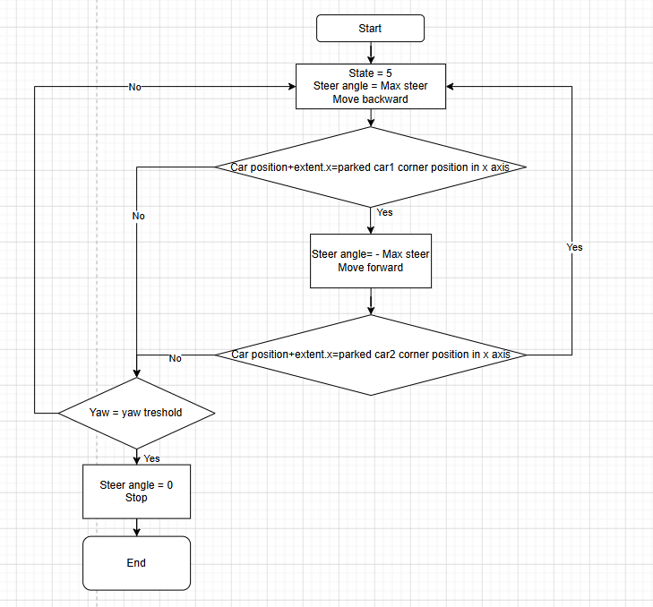
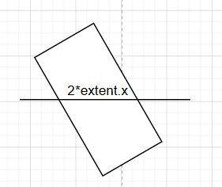

# CARLA Autonomous Parallel Parking

A fully autonomous parallel parking system built on the [CARLA](https://carla.org/) simulator. An Audi e-tron ego vehicle detects a parking gap between two stationary cars and executes a multi-phase manoeuvre using a state-machine controller with PID speed regulation, obstacle sensors, IMU feedback, and real-time trajectory logging.

---

## Features

- **5-state parking state machine** — pull-up → reverse arc → steer unwind → shunt loop → parked
---

## Project Structure

```
.
├── spawn_car.py      # Main autonomous parking simulation
├── graphplotter.py   # Plot trajectory & dynamics from saved logs
├── pathtest.py       # Standalone geometry / turning-radius calculator
└── README.md
```

---

## Prerequisites

| Dependency | Notes |
|---|---|
| [CARLA Simulator](https://carla.org/) | Tested on CARLA 0.9.x — must be running before launching the script |
| Python 3.7+ | |
| `carla` Python package | Provided with the CARLA installation (`PythonAPI/`) |
| `pygame` | `pip install pygame` |
| `numpy` | `pip install numpy` |
| `matplotlib` | `pip install matplotlib` (for `graphplotter.py`) |
| `keyboard` | `pip install keyboard` |

---

## Getting Started

### 1. Start the CARLA server

```bash
# Windows
CarlaUE4.exe

# Linux
./CarlaUE4.sh
```

### 2. Run the parking simulation
This project run in window with python version 3.7
```bash
py -3.7 .\spawn_car_.py  
```

The script will:
1. Connect to `localhost:2000`
2. Spawn two parked Audi e-tron vehicles and one ego vehicle
3. Execute the autonomous parking sequence autonomously
4. Save logs on exit

### 3. Plot the results

After a run, two log files are created in the working directory:
Then Edit the filenames at the top of `graphplotter.py` to match, then run:

```bash
py -3.7 .\graphplotter.py
```

This opens a 2×3 figure with:

| Graph | Content |
|---|---|
| 1 | Trajectory — X vs Y position |
| 2 | Velocity over time (m/s) |
| 3 | X and Y position over time |
| 4 | Acceleration over time (m/s²) |
| 5 | Jerk over time (m/s³) |
| 6 | Steering wheel angle over time (°) |

---

## Parking State Machine

```
State 1  FWD pull-up      Drive forward to pull-up X using PID control
State 2  Arc 1 rev-right  Reverse with full right lock until yaw ≥ ARC1_YAW_DEG
State 3  Steer unwind      Hold brake, gradually unwind steering to 0°
State 5  Shunt loop        Alternate fwd/rev shunts (full-lock each way)
                           until |yaw| ≤ 2° and speed < 0.02 m/s
State 6  Parked            Apply hand-brake; log total shunting actions
```

> State 4 (straight reverse) is available in the codebase for alternative manoeuvre strategies.

---
---

## Diagrams

### Multi-Trial Process Flowchart



---

### Collision Check



> **Gap formula:**
> ```
> extent.x = car_length   OR   hitblock / 2 + gap
> ```

---

## Output Files

| File | Description |
|---|---|
| `green_path_<timestamp>.txt` | JSON array — `[x, y, elapsed_s, velocity_ms, accel_ms2, jerk_ms3, direction]` per frame |
| `steer_log_<timestamp>.txt` | JSON array — `[elapsed_s, wheel_angle_deg]` per frame |
| `parking_model_<timestamp>.csv` | Vehicle specs, wheel parameters, gear ratios, and all parking constants |

---

## Configuration

Key constants at the top of `spawn_car.py`:

```python
MAX_STEER_ANGLE   = 30.0   # Physical wheel lock (degrees)
THROTTLE_FWD      = 0.20   # Forward throttle in shunt loop
THROTTLE_REV      = 0.32   # Reverse throttle
PULL_UP_X         = 14.5   # X coordinate to stop before reversing
ARC1_YAW_DEG      = 45     # Yaw target for the first reversing arc
MAX_STEER_ANGLE_STATE2 = 30
```

## `pathtest.py` — Parking Geometry Calculator

### Summary

`pathtest.py` is a standalone geometry tool that calculates the **optimal arc parameters** for the parallel parking manoeuvre before you run the full simulation. Given the vehicle's wheelbase, maximum steering angle, start position, and target parking-spot coordinates, it solves the two-circle rolling geometry and outputs the two constants that must be pasted into `spawn_car.py`:

| Output | Maps to constant | Description |
|---|---|---|
| `steer angle (degrees)` | `MAX_STEER_ANGLE_STATE2` | Steering lock to apply during Arc 1 |
| `theta (degrees)` | `ARC1_YAW_DEG` | Yaw angle target to exit Arc 1 and begin the unwind |

---

### How It Works

The script models the classic two-tangent-circle parallel parking geometry:

```
      Start pos (Einit_x, Einit_y)
           │
           │  Arc 1 (radius Reinitr) — right reverse lock
           │
      Tangent point ──► Arc 2 (radius Remin) — left reverse lock
                               │
                         Parking spot (Ex, Ey)
```

1. **Minimum turning radius** `Remin` is derived from the wheelbase `a` and `steer_angle_deg`.
2. The **left circle centre** `(clx, cly)` is placed directly above the parking spot at `Remin`.
3. The **right circle centre** `(Crx, Cry)` is solved so that the two circles are externally tangent — ensuring the car can transition smoothly from Arc 1 to Arc 2.
4. `theta` is the yaw the vehicle has rotated through at the tangent point → this is `ARC1_YAW_DEG`.
5. `thetasteer` is the steering angle required for Arc 1 → this is `MAX_STEER_ANGLE_STATE2`.

---

### Configuration (edit the top of `pathtest.py`)

```python
Ex, Ey             = 10, 9.5    # Target parking spot (CARLA world coords)
Einit_x, Einit_y   = 15, 12     # Vehicle position at the start of Arc 1
a                  = 2.9        # Wheelbase (metres) — check vehicle specs
steer_angle_deg    = 30         # Maximum physical steering lock (degrees)
```

> **Tip:** `Einit_x` corresponds to `PULL_UP_X` in `spawn_car.py` — set them to the same value.

---

### Running the Calculator

No CARLA server required — this is pure Python:

```bash
py -3.7 .\pathtest.py
```

**Example output:**
```
steer angle (degrees):  30.0
45.0
```

Copy the two values into `spawn_car.py`:

```python
MAX_STEER_ANGLE_STATE2 = 30.0   # ← steer angle output
ARC1_YAW_DEG           = 45     # ← theta output
```

---
---
ARC1_YAW_DEG and MAX_STEER_ANGLE_STATE2 can calculate from pathtest.py

## License

This project is provided for research and educational use. CARLA is licensed under the MIT License.
